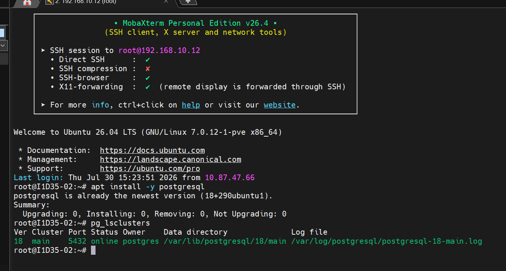
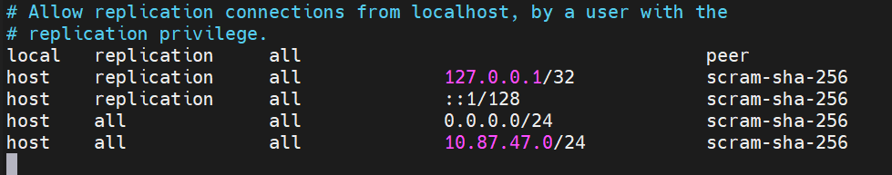

## Aula 02
Para verificar o status e demais informações do banco de dados, utilizamos o comando:

```bash
pg_lsclusters
```


-----
Para acesso, via root, sem senha (SOCKET LOCAL)

```bash
sudo -u postgres psql
```
>Com esse comando, não preciso mostrar quem o meu usuário é, o Linux já faz a autenticação.

>`\q` retorna ao usuário anterior (/quit)
----
Para alteração de senha ao usuário POSTGRES, utilizamos o comando:

```sql
ALTER USER postgres PASSWORD 'senha67';
```

Após alteração da senha, o acesso, via localhost (Socket Externo), é feito através do comando:

```bash
sudo psql -h 127.0.0.1 -U postgres
```

Configurações iniciais do Postgres:
-Para habilitar conexões externas, de outros IPs, foi necessário as seguintes etapas:
1.Navegar até a pasta do POSTGRESQL (`/etc/postgres/18/main/`).
2.Editar o arquivo `postgresql.conf`através do comando:

```bash
sudo nano postgresql.conf
```

3.Editar a linha listen_adresses = '*';

4.Editar o arquivo pg_hbs.conf

5.Nas últimas, linhas adicionais as seguintes configurações:



---

**Criação do primeiro Banco de Dados**
```mermaid
grafh TD
A[(Banco de Dados)]
```

Para criar o Banco de Dados, utilizamos o comando:
```sql
CREATE DATABASE cidades;
```

Para verificar os bancos existentes:
```sql
\l
```


