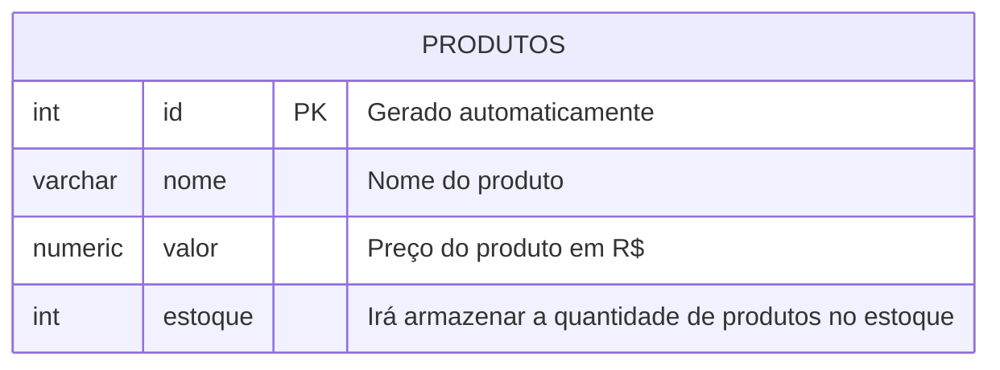

## AULA-03
Para apagar um banco de dados, utilizamos o comando:

```sql
DROP DATABASE cidades;
```

>Não esquecer do ;

---

**Modelagem do Banco de Dados**



Após modelar, iremos executar as etapas de criação e inserção de dados.
---
Pra criar a primeira tabela, usamos os comandos:
```sql
CREATE TABLE produtos(
 id INT GENERATED ALWAYS AS IDENTITY PRIMARY KEY,
nome VARCHAR(100) NOT NULL,
 valor NUMERIC(10,2) NOT NULL,
 estoque INT NOT NULL DEFAULT 0
);
```
---
Para consultar todos elementos da tabela, uso o comando:

```sql
SELECT * FROM produtos;
```
---
Para inserir dados na tabela, usamos o comando:

```sql
INSERT INTO produtos(nome,valor,estoque)
VALUES('Caneta','1.50','100');
```
---
Comecei criando ("cidades";) no MobaXterm
```
Então criei uma tabela chamada "bigCty".
Ela vai armazenar informações sobre cidades grandes.
```
---
IMPORTANTE:
O nome da tabela precisa ser o mesmo que foi criado.
Como a tabela criada foi "bigCty", vou usar "bigCty".
```sql
INSERT INTO bigCty(nome, pais, populacao)
```
------
Estou inserindo várias cidades de uma vez.
Cada conjunto entre parênteses representa uma cidade.
```

 A ordem dos valores segue a ordem das colunas:

VALUES
('Jacarta', 'Indonésia', 41.9),
('Daca', 'Bangladesh', 36.6),
('Tóquio', 'Japão', 33.4),
('Deli', 'Índia', 30.2),
('Xangai', 'China', 29.5),
('Cidade do México', 'México', 22.7),
('Pequim', 'China', 22.5),
('Cairo', 'Egito', 22.0),
('Mumbai', 'Índia', 22.0),
('Osaka', 'Japão', 18.9);

Select novamente!
SELECT * FROM bigCty;
```


