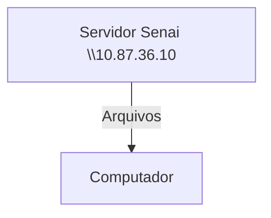

## Configuração do servidor educacional

O objetivo é simular um ambiente real de produção


---
**Objetivo**:
- Experiencia real de mercado,
- Administração de recursos,
- Experiencia em servidores Linux.

## Servidor de arquivos 
Servidor educacional para arquivos, assim não dependendo da rede externa.



---
## Servidor de Desenvolvimento
- Cada aluno recebe o seu próprio acesso.
- Cada maquina recebe um endereço de IP diferente.

>**IP**: 192.168.10.12

|Recurso|Configuração|
|-------|------------|
|CPU|2 cores|
|RAM| 512 MB|
|DISCO|6 GB|
|SISTEMA OPERACIONAL| Ubuntu 26.04 LTS|
|ACESSO| SSH (Secure Shell)|


Dados de acesso
|Campo|Valor|
|-----|-----|
|IP do container| 192.168.10.12|
|Usuario|Root|
|Senha inicial:| aluno01|


Comando para visualizar recursos:
```bash
htop
```

Comando para alterar a senha:
```bash 
passwd
```
---

## Banco de Dados
-Dados: isolados que não dizem muita coisa. Ex: Platini, Futebol, Chuteira
-Informação: Dados estruturados. Ex: O Platini comprou uma chuteira para jogar futebol.
-Conhecimento: O que podemos extrair a partir das informações. Ex: O Platini gosta de jogar futebol

---

O fluxo normal de um banco de dados está representado a seguir:

>por qual razão, as empresas não salvam os dados em arquivos comuns?

 ```mermaid
graph TD
A[Guardar Dados]-->B[Banco de dados]
A[Guardar Dados]-->C[Arquivos/Planilhas]
B-->B1[Varios usuários ao mesmo tempo]
B-->B2[Backup e sincronização]
B-->B3[Consultas otimizadas/rápidas]
C-->C1[ Um arquivo por vez]
C-->C2[Backup ineficiente]
```
---

## SGBD
#### Sistema Gerenciador de Banco de Dados

>POSTGRESQL: SGBD OpenSource e muito completo

Primeito, começamos atualizando os pacotes:
>sudo apt update && upgrade 

```
Para instalação do Postgresql:
```bash
sudo apt install -y postgresql
```


